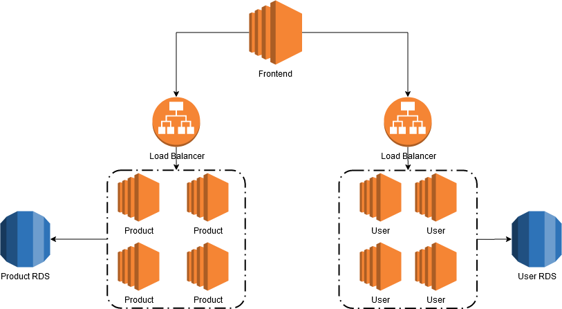

# ecommerce-app
Example  of ecommerce application. 

There are 2 services provided here: product & user service

In product service, a user can view product detail.
And in user service, a user can login and view user detail.

For infrastructure, frontend will connect to services' load balancer to get data. It uses load balancer because the application uses an autoscaling group to scale the application based on demand.
